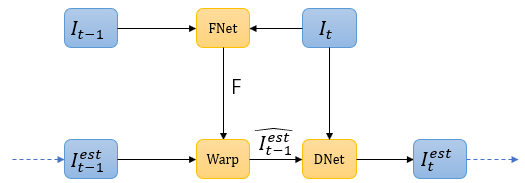
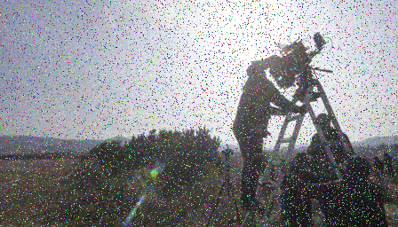
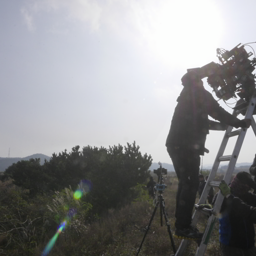
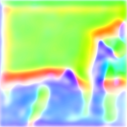
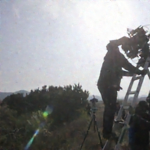
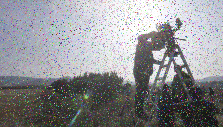
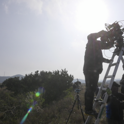
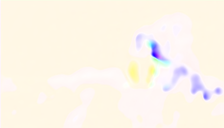
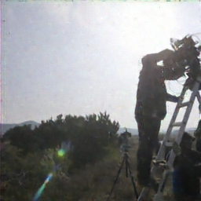
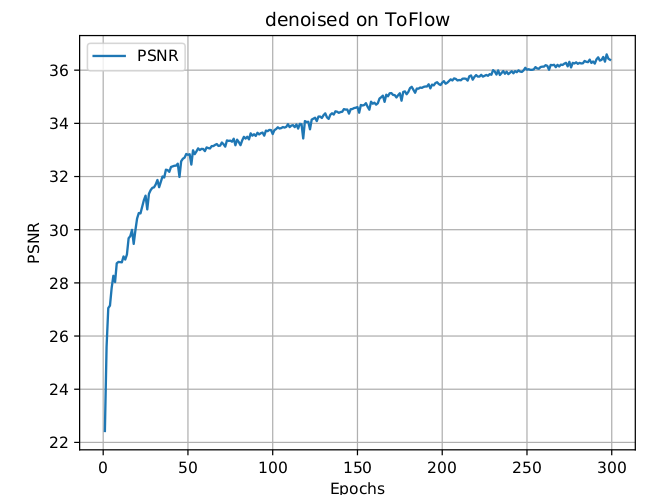

# denoising-pytorch
image/video denosing with pytorch code


This code is modified from EDSR-pytorch github repo
        :[https://github.com/thstkdgus35/EDSR-PyTorch]

for video denosing.

The method is adpated from CVPR2018 paper
    : [Frame-Recurrent Video Super-Resolution](https://arxiv.org/abs/1801.04590)


We name it  Frame-Recurrent Video Denoising (FRVD)

## 1. Network Architecture


Fig 1. The recurrent module for Frame Recurrent Video Denoising (FRVD)

## 2. Training Specification
### 2.1 Data Preparation
Data load function is under /code/data directory.

If you want to directly adopt our implementation toflow dataset, You should format your data with the directory structure as follow:

```
ROOT
-input
--00001(video ID)
---0266(sequenceID)
----001.png
----002.png
...
-target
...corresponding to input
```
Otherwise, you should reimplement your own dataset in this dir.

In futher, we will try to support standard datasets.
### 2.2 Loss Function

In /code/loss directory, EDSR officical code has implemented a lot of widely-used loss functions.

We have adopted mse loss for training now.

### 2.3 Training Command
```
python main.py --loss '1.0*MSE' --loss_flow '1.0*MSE' --save_gt --save_results --save "frvd-v0.1"
```

## 3. Result Presentation
1.denoising results & optical flow results

<p align="center">
    
    
    
    
</p>
<p align="center">Figure 1. Denoising result on Frame 0, [Noise, Target, Flow, Denoise]</p>

<p align="center">
    
    
    
    
</p>
<p align="center">Figure 2. Denoising result on Frame 1, [Noise, Target, Flow, Denoise]</p>

2.training psnr via epochs

<p align="center">

Figure 3. Validation PSNR via epochs during training processing.</p>

3.testing psnr via frame

<p align="center">

Figure 4. testing PSNR via frame index.</p>

Temporal inconsistencies have occured on ToFlow Denoising testing dataset. This is an urgent problem to be solved.


## 4 To do list...
1. Use more realistic noised images
2. analyze the reasons for not satisfying the time continuity, as shown in Section 3.1

## 5. Licence
This project is licensed under the GNU General Public License v3.0. The terms and conditions can be found in the LICENSE files.

## 6. Contribution
Tao Zhang (lrhselous@nuaa.edu.cn)
