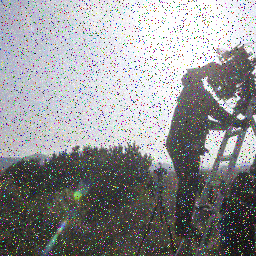
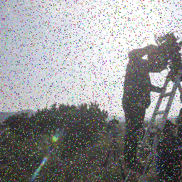
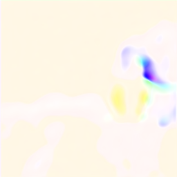
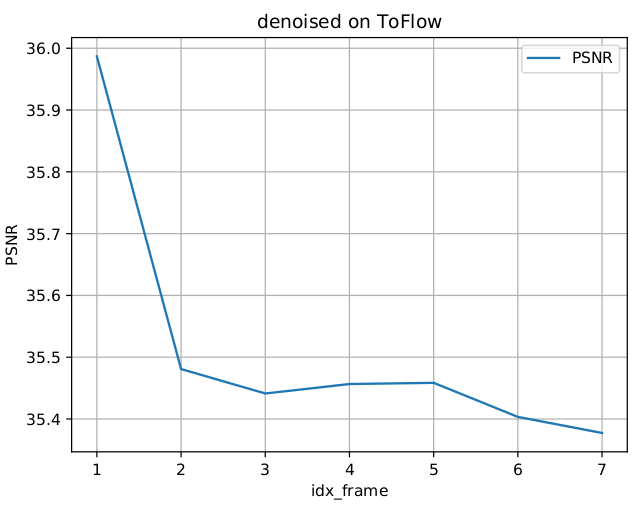
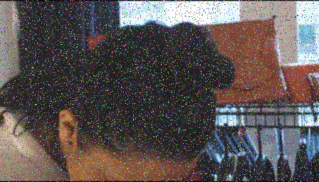
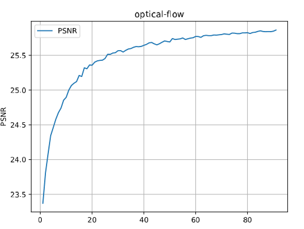

# Denoising-Pytorch
image/video denosing with pytorch code


This code is modified from EDSR-pytorch github repo
        :[https://github.com/thstkdgus35/EDSR-PyTorch]

for video denosing.

The method is adpated from CVPR2018 paper
    : [Frame-Recurrent Video Super-Resolution](https://arxiv.org/abs/1801.04590)


We name it  Frame-Recurrent Video Denoising (FRVD)

## 1. Network Architecture


Fig 1. The recurrent module for Frame Recurrent Video Denoising (FRVD)

## 2. Training Specification
### 2.1 Data Preparation
Data load function is under /code/data directory.

If you want to directly adopt our implementation toflow dataset, You should format your data with the directory structure as follow:

```
ROOT
-input
--00001(video ID)
---0266(sequenceID)
----001.png
----002.png
...
-target
...corresponding to input
```
Otherwise, you should reimplement your own dataset in this dir.

In futher, we will try to support standard datasets.
### 2.2 Loss Function

In /code/loss directory, EDSR officical code has implemented a lot of widely-used loss functions.

We have adopted mse loss for training now.

### 2.3 Training Command
```
python main.py --model frvdwof --n_frames 7 --model_label 2  --loss_denoise "1.0*MSE" --loss_flow "4.0*L1+3.0*TVL1" --save_result --save_gt --save_of --save "frvdwof-v0.1" --data_range "1-800/801-824"
```
More command can be found in command.txt, all commands are tested correctly in the latest code repo.

## 3. Result Presentation
3.1. denoising results & optical flow results

<p align="center">
    
    
    
    
    
</p>
<p align="center">Figure 1. Denoising result on Frame 0, [Noise, Target, Flow, Denoise, Warped-previous-frame]</p>

<p align="center">
    
    
    
    
    
</p>
<p align="center">Figure 2. Denoising result on Frame 1, [Noise, Target, Flow, Denoise, Warped-previous-frame]</p>

3.2. training psnr via epochs

<p align="center">
</p>
<p align="center">
Figure 3. Validation PSNR via epochs during training processing.</p>

3.3. testing psnr via frame

<p align="center">

</p>
<p align="center">
Figure 4. testing PSNR via frame index.</p>

Temporal inconsistencies have occured on ToFlow Denoising testing dataset due to the bad results of optical flow task. This is an urgent problem to be solved.


## Updated 3.  Result Presentation
3.1. realistic noised images

We have reprocessed the ToFlow dataset, and add more realistic noise on images.
<p align="center">
    
    
    
    
</p>
<p align="center">
Figure 5.  Gaussian noised images and more-Realistic noised images.</p>

3.2. Results Presentation

We have tried  **Frame-recurrent Video Denoising method witout optical flow**. The PSNR results on test datasets
are satisfying the time continuity, as shown in following figure. We assert that the bad results of optical flow task
have pose a negative effect on denoising task.


<p align="center">

</p>
<p align="center">
Figure 6. Testing PSNR via frame index.</p>

## 4. Refined Optical-Flow task
The Optical Flow Task is motivated by [AAAI 2018 paper](https://pdfs.semanticscholar.org/47bc/34ae6f5dc104bc289ae3bb4fa75ef75fbc21.pdf)
Command:
```
python main.py --model flow.flownets --n_frames 6 --model_label 0  --loss_flow "4.0*L1+4.0*TVL1" --save_results --save_gt --save "fnet-v0.6-pre_dnoise" --tn  --data_range "1-800/801-824"
```
4.1 Architecture
<p align="center">

</p>
<p align="center">
Figure 6. Architecture of optical flow we used.</p>
4.2 Loss
<p align="center">

</p>
<p align="center">
Figure 7. Loss function.</p>

4.3 Results Presentation

a) On Clean Dataset Setting.
<p align="center">

</p>
<p align="center">
Figure 8.1. PSNR of validation set on clean data.</p>

<p align="center">

</p>
<p align="center">
Figure 8.2. aligned results of validation set on clean data.</p>

b) On Noised Dataset Setting
<p align="center">

</p>
<p align="center">
Figure 9.1. PSNR of validation set on noised data.</p>

<p align="center">

</p>
<p align="center">
Figure 9.2. aligned results of validation set on noised data.</p>

**Conclusion: The PSNR value on noised data is far lower than that on clean data. The optical map has many noised points as shown in Figure 9.2 compared with Figure 8.2.**

Refined plan (On Training):
1. Integrating denoising module into FlowNetS-module.
2. Tuning the trade-off parameter $\lambda$ in Loss Function. TV Loss is instrumental to constrain the smoothness property of flow-map.

## Updated 3 Again
We integratd the refined flownet module into denoising module, as illustrated in Figure 1.

We are able to get time-continuity PSNR values via frame index. We have also formulated the test results into a video file for a more clear understanding.

[Video denoised result  of model FRVD with optical flow](show/frvdwof/frvdwof_presentation.mp4)

<p align="center">

</p>
<p align="center">
Figure 10. Example of Video Frame .</p>

## 5. Problems
The Mean PSNR of FRVD with optical flow (35.739) is slightly inferior to that of FRVD (36.286).

## 6. Licence
This project is licensed under the GNU General Public License v3.0. The terms and conditions can be found in the LICENSE files.

## 7. Contribution
Tao Zhang (lrhselous@nuaa.edu.cn)
